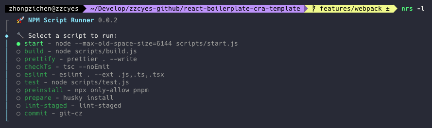
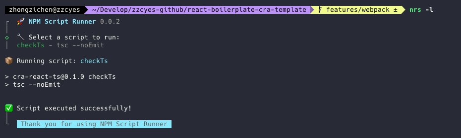
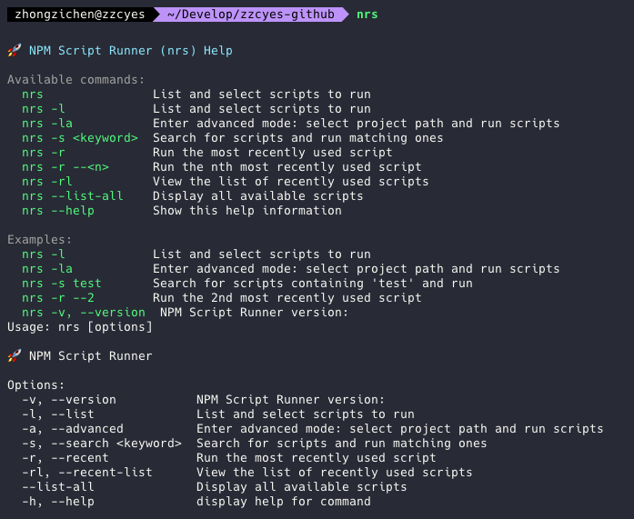

# scriptz-cli (nrs)

English | [简体中文](./README.zh-cn.md)

NPM Script Runner is a command-line tool for visualizing and running scripts from package.json. It provides an interactive interface that makes finding and executing npm scripts easier.





## Features

- Visualize scripts from package.json
- Interactive script selection and execution
- Support for script searching
- Record recently run scripts
- Advanced mode for selecting different project paths

## Installation

Global installation:

```bash
npm install -g scriptz-cli
```

Or local installation in a project:

```bash
npm install --save-dev scriptz-cli
```

## Usage

### Basic Usage

```bash
nrs
```

This will display help information and available commands.



### List and Select Scripts to Run

```bash
nrs -l
```

### Advanced Mode: Select Project Path and Run Scripts

```bash
nrs -la
```

### Search and Run Matching Scripts

```bash
nrs -s <keyword>
```

### Run Recently Used Script

```bash
nrs -r
```

### Run the nth Recently Used Script

```bash
nrs -r --<n>
```

For example, to run the 2nd most recently used script:

```bash
nrs -r --2
```

### List Recently Used Scripts

```bash
nrs -rl
```

### List All Available Scripts

```bash
nrs --list-all
```
