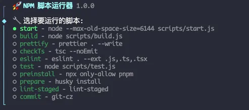

# scriptz-cli (nrs)

[English](./README.md) | 简体中文

NPM 脚本运行器是一个命令行工具，用于可视化展示和运行 package.json 中的脚本。它提供了一个交互式界面，使得查找和执行 npm 脚本变得更加容易。



## 特性

- 可视化展示 package.json 中的脚本
- 交互式选择和运行脚本
- 支持搜索脚本
- 记录最近运行的脚本
- 支持高级模式，可选择不同的项目路径

## 安装

全局安装：

```bash
npm install -g npm-run-script
```

或者在项目中本地安装：

```bash
npm install --save-dev npm-run-script
```

## 使用方法

### 基本用法

```bash
nrs
```

这将显示帮助信息和可用的命令。

### 列出并选择要运行的脚本

```bash
nrs -l
```

### 高级模式：选择项目路径并运行脚本

```bash
nrs -la
```

### 搜索并运行匹配的脚本


```bash
nrs -s <keyword>
```

### 运行最近使用的脚本

```bash
nrs -r
```

### 运行第 n 个最近使用的脚本

```bash
nrs -r --<n>
```


例如，运行第 2 个最近使用的脚本：

```bash
nrs -r --2
```

### 列出最近使用的脚本

```bash
nrs -rl
```

### 列出所有可用的脚本

```bash
nrs --list-all
```
